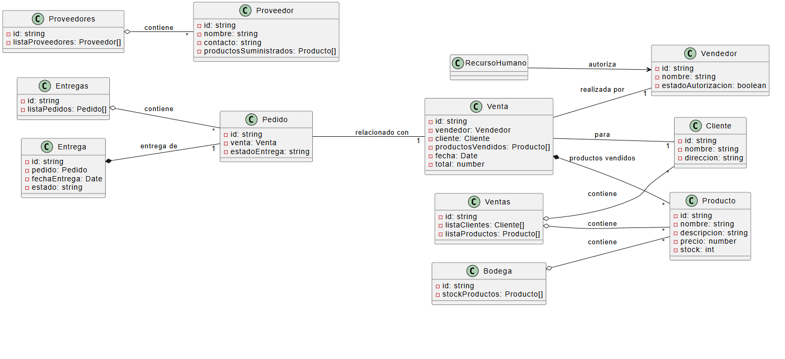

# API PoliMarket - Sistema de Gestión de Ventas

Esta es una API REST completa desarrollada en NestJS que implementa un sistema de gestión de ventas basado en el diagrama de clases proporcionado. Utiliza SQLite como base de datos embebida.

## 📋 Diagramas del Sistema

### Diagrama de Clases


**Descripción:** Este diagrama muestra la estructura de clases del sistema PoliMarket y sus relaciones. Las principales entidades son:

- **Cliente**: Representa a los clientes del sistema con atributos como nombre y dirección
- **Producto**: Representa los productos disponibles con precio, stock y descripción
- **Vendedor**: Representa a los vendedores con estado de autorización
- **Venta**: Registra las transacciones de venta con fecha y total
- **Pedido**: Gestiona los pedidos y su estado de entrega
- **Entrega**: Controla el proceso de entrega de pedidos con fecha y estado
- **Proveedor**: Representa a los proveedores de productos

**Relaciones principales:**
- **Agregación**: Cliente y Producto participan en Ventas (relación de agregación)
- **Composición**: Productos están compuestos en Venta (relación de composición)
- **Asociación**: Venta se asocia con Vendedor y Cliente
- **Dependencia**: Pedido depende de Venta para su existencia

### Diagrama de Componentes


**Descripción:** Este diagrama muestra la arquitectura de componentes del sistema y cómo interactúan entre sí. Los componentes principales son:

- **Ventas**: Gestiona el proceso de ventas y transacciones
- **Bodega**: Controla el inventario y stock de productos
- **Proveedores**: Administra la información de proveedores
- **Entregas**: Maneja el proceso de pedidos y entregas
- **Recurso Humano**: Gestiona la autorización de vendedores
- **Clientes**: Administra la información de clientes
- **Productos**: Gestiona el catálogo de productos

**Interfaces y dependencias:**
- **IConsultaProducto**: Interface que permite consultar información de productos
- **IGestionStock**: Interface para gestionar el stock de productos
- **IInformacionProveedor**: Interface para obtener información de proveedores
- **IRegistroPedidos**: Interface para registrar y gestionar pedidos
- **IAutorizable**: Interface para manejar la autorización de vendedores

**Flujo de datos:**
- Ventas utiliza IConsultaProducto para verificar disponibilidad
- Bodega implementa IGestionStock para control de inventario
- Proveedores proporciona IInformacionProveedor para datos de proveedores
- Entregas usa IRegistroPedidos para gestionar pedidos
- Recurso Humano implementa IAutorizable para autorizar vendedores

## 🏗️ Arquitectura

La aplicación está estructurada siguiendo el patrón de módulos de NestJS y implementa todas las entidades y relaciones del diagrama de clases:

### Entidades Principales
- **Cliente**: Gestión de clientes
- **Producto**: Gestión de productos con stock
- **Vendedor**: Gestión de vendedores con autorización
- **Venta**: Registro de ventas
- **Pedido**: Gestión de pedidos y entregas
- **Proveedor**: Gestión de proveedores

### Módulos de la Aplicación
- **Ventas**: Gestión completa de ventas
- **Bodega**: Control de stock y gestión de inventario
- **Proveedores**: Gestión de proveedores y sus productos
- **Entregas**: Control de pedidos y entregas
- **Recurso Humano**: Autorización y gestión de vendedores
- **Clientes**: Gestión de clientes
- **Productos**: Gestión de productos

## 🚀 Instalación

### Prerrequisitos
- Node.js (versión 16 o superior)
- npm o yarn

### Pasos de instalación

1. **Clonar o descargar el proyecto**
```bash
# Si tienes el proyecto en un repositorio
git clone <url-del-repositorio>
cd polimarket-api
```

2. **Instalar dependencias**
```bash
npm install
```

3. **Ejecutar la aplicación**
```bash
# Modo desarrollo
npm run start:dev

# Modo producción
npm run start:prod
```

La aplicación estará disponible en `http://localhost:3000`

## 📊 Base de Datos

La aplicación utiliza SQLite como base de datos embebida. El archivo de base de datos (`polimarket.db`) se creará automáticamente en la raíz del proyecto cuando ejecutes la aplicación por primera vez.

### Configuración de la base de datos
```typescript
TypeOrmModule.forRoot({
  type: 'sqlite',
  database: 'polimarket.db',
  entities: [Cliente, Producto, Vendedor, Venta, Pedido, Proveedor],
  synchronize: true, // Solo para desarrollo
  logging: true,
})
```

## 🔌 Endpoints de la API

### Clientes
- `GET /clientes` - Obtener todos los clientes
- `GET /clientes/:id` - Obtener cliente por ID
- `GET /clientes/:id/ventas` - Obtener cliente con sus ventas
- `POST /clientes` - Crear nuevo cliente
- `PATCH /clientes/:id` - Actualizar cliente
- `DELETE /clientes/:id` - Eliminar cliente

### Productos
- `GET /productos` - Obtener todos los productos
- `GET /productos/:id` - Obtener producto por ID
- `GET /productos/stock-bajo` - Obtener productos con stock bajo
- `GET /productos/proveedor/:proveedorId` - Obtener productos por proveedor
- `POST /productos` - Crear nuevo producto
- `PATCH /productos/:id` - Actualizar producto
- `PATCH /productos/:id/stock` - Actualizar stock de producto
- `DELETE /productos/:id` - Eliminar producto

### Vendedores (Recurso Humano)
- `GET /recurso-humano/vendedores` - Obtener todos los vendedores
- `GET /recurso-humano/vendedores/autorizados` - Obtener vendedores autorizados
- `GET /recurso-humano/vendedores/no-autorizados` - Obtener vendedores no autorizados
- `GET /recurso-humano/vendedores/:id` - Obtener vendedor por ID
- `POST /recurso-humano/vendedores` - Crear nuevo vendedor
- `PATCH /recurso-humano/vendedores/:id` - Actualizar vendedor
- `POST /recurso-humano/vendedores/:id/autorizar` - Autorizar/desautorizar vendedor
- `DELETE /recurso-humano/vendedores/:id` - Eliminar vendedor

### Ventas
- `GET /ventas` - Obtener todas las ventas
- `GET /ventas/:id` - Obtener venta por ID
- `POST /ventas` - Registrar nueva venta
- `PATCH /ventas/:id` - Actualizar venta
- `DELETE /ventas/:id` - Eliminar venta

### Bodega
- `GET /bodega/productos` - Obtener todos los productos en bodega
- `GET /bodega/productos/:id` - Obtener producto específico
- `GET /bodega/productos/:id/stock` - Obtener stock de producto
- `GET /bodega/productos/:id/proveedor` - Obtener proveedor de producto
- `PATCH /bodega/productos/:id/stock` - Actualizar stock (entrada/salida)
- `GET /bodega/stock-bajo` - Obtener productos con stock bajo

### Proveedores
- `GET /proveedores` - Obtener todos los proveedores
- `GET /proveedores/:id` - Obtener proveedor por ID
- `GET /proveedores/:id/productos` - Obtener productos de un proveedor
- `POST /proveedores` - Crear nuevo proveedor
- `PATCH /proveedores/:id` - Actualizar proveedor
- `DELETE /proveedores/:id` - Eliminar proveedor

### Entregas
- `GET /entregas` - Obtener todos los pedidos
- `GET /entregas/estado/:estado` - Obtener pedidos por estado
- `GET /entregas/:id` - Obtener pedido por ID
- `POST /entregas` - Crear nuevo pedido
- `PATCH /entregas/:id` - Actualizar pedido
- `POST /entregas/:id/entregar` - Marcar pedido como entregado
- `DELETE /entregas/:id` - Eliminar pedido

## 📝 Ejemplos de Uso

### Crear un cliente
```bash
curl -X POST http://localhost:3000/clientes \
  -H "Content-Type: application/json" \
  -d '{
    "nombre": "Juan Pérez",
    "direccion": "Calle Principal 123"
  }'
```

### Crear un vendedor
```bash
curl -X POST http://localhost:3000/recurso-humano/vendedores \
  -H "Content-Type: application/json" \
  -d '{
    "nombre": "María García",
    "estadoAutorizacion": false
  }'
```

### Autorizar un vendedor
```bash
curl -X POST http://localhost:3000/recurso-humano/vendedores/{vendedor-id}/autorizar \
  -H "Content-Type: application/json" \
  -d '{
    "estadoAutorizacion": true
  }'
```

### Crear un producto
```bash
curl -X POST http://localhost:3000/productos \
  -H "Content-Type: application/json" \
  -d '{
    "nombre": "Laptop HP",
    "descripcion": "Laptop HP Pavilion 15",
    "precio": 899.99,
    "stock": 10
  }'
```

### Registrar una venta
```bash
curl -X POST http://localhost:3000/ventas \
  -H "Content-Type: application/json" \
  -d '{
    "vendedorId": "{vendedor-id}",
    "clienteId": "{cliente-id}",
    "productosIds": ["{producto-id-1}", "{producto-id-2}"]
  }'
```

## 🔧 Desarrollo

### Scripts disponibles
- `npm run start:dev` - Ejecutar en modo desarrollo con hot reload
- `npm run start:debug` - Ejecutar en modo debug
- `npm run start:prod` - Ejecutar en modo producción
- `npm run build` - Compilar el proyecto
- `npm run test` - Ejecutar tests
- `npm run test:watch` - Ejecutar tests en modo watch
- `npm run lint` - Ejecutar linter

### Estructura del proyecto
```
src/
├── entities/           # Entidades de TypeORM
├── dto/               # Data Transfer Objects
├── interfaces/        # Interfaces del diagrama de clases
├── modules/           # Módulos de la aplicación
│   ├── ventas/
│   ├── bodega/
│   ├── proveedores/
│   ├── entregas/
│   ├── recurso-humano/
│   ├── clientes/
│   └── productos/
├── app.module.ts      # Módulo principal
└── main.ts           # Punto de entrada
```

## 🛡️ Validación

La aplicación utiliza `class-validator` para validar los datos de entrada. Todos los DTOs incluyen validaciones apropiadas para asegurar la integridad de los datos.

## 🔄 Relaciones del Diagrama de Clases

La implementación respeta todas las relaciones definidas en el diagrama de clases:

- **Agregación**: Cliente y Producto en Ventas
- **Composición**: Productos en Venta
- **Asociaciones**: Venta-Vendedor, Venta-Cliente, Pedido-Venta
- **Dependencias**: Ventas usa IConsultaProducto, Bodega usa IInformacionProveedor
- **Interfaces**: Implementación de todas las interfaces definidas

## 📈 Características Implementadas

- ✅ Gestión completa de CRUD para todas las entidades
- ✅ Validación de datos con class-validator
- ✅ Base de datos SQLite embebida
- ✅ Relaciones entre entidades
- ✅ Implementación de interfaces del diagrama
- ✅ Control de autorización de vendedores
- ✅ Gestión de stock automática
- ✅ API REST completa
- ✅ Manejo de errores
- ✅ Logging de operaciones

## 🧩 Componentes del Sistema

### Componentes identificados:

**Componente de Gestión de Clientes**
- Entidades: Cliente
- Responsabilidad: Administrar la información de los clientes del sistema

**Componente de Gestión de Productos**
- Entidades: Producto
- Responsabilidad: Manejar el catálogo de productos disponibles

**Componente de Gestión de Proveedores**
- Entidades: Proveedor
- Responsabilidad: Administrar la información de los proveedores

**Componente de Gestión de Vendedores**
- Entidades: Vendedor
- Responsabilidad: Gestionar el personal de ventas

**Componente de Gestión de Ventas**
- Entidades: Venta
- Responsabilidad: Procesar y registrar las transacciones de venta

**Componente de Gestión de Pedidos**
- Entidades: Pedido
- Responsabilidad: Administrar los pedidos realizados

**Componente de Gestión de Entregas**
- Entidades: Entrega
- Responsabilidad: Controlar el proceso de entrega de productos

### Relaciones entre componentes:

- **Cliente ↔ Venta**: Los clientes realizan ventas
- **Vendedor ↔ Venta**: Los vendedores procesan las ventas
- **Producto ↔ Venta**: Los productos son vendidos en las transacciones
- **Producto ↔ Pedido**: Los productos pueden ser solicitados en pedidos
- **Proveedor ↔ Producto**: Los proveedores suministran productos
- **Pedido ↔ Entrega**: Los pedidos generan entregas
- **Cliente ↔ Entrega**: Los clientes reciben las entregas

